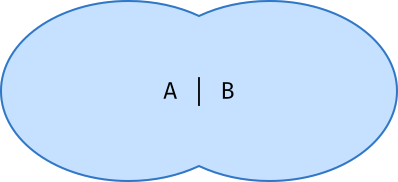
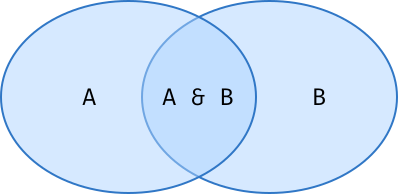
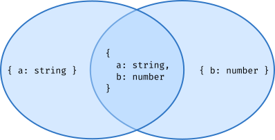
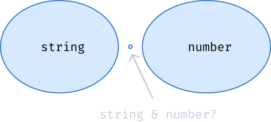

import { Head, Image, Appear } from 'mdx-deck';

import Code from './Code';
import Cover from './Cover';
import Intro from './Intro';
import Website from './Website';
import Thanks from './Thanks';

export { default as theme } from './theme';
export * as components from './components';

<Head>
  <link rel="preconnect" href="https://fonts.googleapis.com" />
  <link rel="preconnect" href="https://fonts.gstatic.com" crossorigin />
  <link
    href="https://fonts.googleapis.com/css2?family=Nunito:wght@400;500;700&display=swap"
    rel="stylesheet"
  />
  <link href="https://fonts.cdnfonts.com/css/cascadia-code" rel="stylesheet" />
  <title>Introduction to Type-Level programming in TypeScript</title>
</Head>

<Cover title="Introduction to Type-Level programming in TypeScript" />

---

<Intro />

---

# Overview

<ul>
  <li>What are Types?</li>
  <li>Primitive types</li>
  <li>Literal types</li>
  <li>Data structures</li>
  <li>Union types</li>
  <li>Intersection types</li>
  <li>Special types</li>
  <li>Conditional types</li>
  <li>Infer types</li>
  <li>Template literal types</li>
  <li>Examples</li>
  <li>Real use cases</li>
</ul>

---

# What are types?

<ul>
  <li>Just sets</li>
  <li>Set theory</li>
</ul>

---

---

# Primitive types

<ul>
  <Appear>
    <li>Built-in types</li>
    <li>
      <code>number</code>
    </li>
    <li>
      <code>string</code>
    </li>
    <li>
      <code>boolean</code>
    </li>
    <li>
      <code>symbol</code>
    </li>
    <li>
      <code>bigint</code>
    </li>
    <li>
      <code>undefined</code>
    </li>
    <li>
      <code>null</code>
    </li>
  </Appear>
</ul>

---

# Literal types

<ul>
  <Appear>
    <li>The exact types</li>
    <li>
      <code>"apple"</code>
    </li>
    <li>
      <code>1</code>
    </li>
    <li>
      <code>true</code>
    </li>
  </Appear>
</ul>

---

---

# Data structures

<ul>
  <Appear>
    <li>
      Objects: <code>{'{ a: string }'}</code>
    </li>
    <li>
      Records: <code>{'{ [key: string]: string }'}</code>
    </li>
    <li>
      Tuples: <code>[string, number]</code>
    </li>
    <li>
      Array: <code>string[]</code>
    </li>
  </Appear>
</ul>

---

# Union types

<ul>
  <li>Join types together</li>
  <li>
    <code>a | b</code>
  </li>
</ul>

---

---

# Intersection types

<ul>
  <li>What belongs to both types</li>
  <li>
    <code>a & b</code>
  </li>
</ul>

---

---

---

# Special types

<ul>
  <Appear>
    <li>
      <code>unknown</code>
    </li>
    <li>
      <code>never</code>
    </li>
    <li>
      <code>any</code>
    </li>
  </Appear>
</ul>

---

## Unknown type

<ul>
  <Appear>
    <li>Contains every type</li>
    <li>
      <code>a | unknown = unknown</code>
    </li>
    <li>
      <code>a & unknown = a</code>
    </li>
  </Appear>
</ul>

---

---

## Never type

<ul>
  <Appear>
    <li>Empty set</li>
    <li>
      <code>string & number</code>
    </li>
    <li>
      <code>a | never = a</code>
    </li>
    <li>
      <code>a & never = never</code>
    </li>
    <li>
      <code>const crash = (): never => process.exit(1);</code>
    </li>
  </Appear>
</ul>

---

---

## Any type

<ul>
  <Appear>
    <li>Doesn't fit in the set theory</li>
    <li>Both supertype and subtype of every other type</li>
    <li>Bad practice</li>
    <li>
      <code>a & any = any</code>
    </li>
    <li>
      <code>a | any = any</code>
    </li>
  </Appear>
</ul>

---

---

# Conditional types

<ul>
  <Appear>
    <li>
      <code>extends</code>
    </li>
    <li>
      <code>"Hello" extends string ? true : false</code>
    </li>
  </Appear>
</ul>

---

# Infer types

<ul>
  <Appear>
    <li>
      <code>{'{ a: string } extends { a: infer V } ? V : never'}</code>
    </li>
  </Appear>
</ul>

---

# Template literal types

<ul>
  <Appear>
    <li>
      <code>
        type T = `${'a' | 'b'} (${'{number}'})`
      </code>
    </li>
  </Appear>
</ul>

---

# Examples

---

<Code
  title="Naturals"
  code={require('!raw-loader!./code/naturals.ts')}
  showNumbers={false}
  dark={true}
  lang="ts"
  steps={[
    { range: [1, 3], notes: 'Nat definition' },
    { range: [5, 12], notes: 'Add' },
    { range: [14, 21], notes: 'Sub' },
    { range: [23, 28], notes: 'Mult' },
    { range: [30, 46], notes: 'Div' },
  ]}
/>

---

<Code
  title="T function options"
  code={require('!raw-loader!./code/templateOptions.ts')}
  showNumbers={false}
  dark={true}
  lang="ts"
/>

---

<Code
  title="Naturals"
  code={require('!raw-loader!./code/naturals.ts')}
  showNumbers={false}
  dark={true}
  lang="ts"
  steps={[
    { range: [1, 3], notes: 'Nat definition' },
    { range: [5, 12], notes: 'Add' },
    { range: [14, 21], notes: 'Sub' },
    { range: [23, 28], notes: 'Mult' },
    { range: [30, 46], notes: 'Div' },
  ]}
/>

---

## Lambda Calculus

Lambda Calculus parser and interpreter made in TypeScript's type system

https://github.com/fersilva16/lcts

---

# Real use cases

- Almost none
- For production: Keep it simple

---

# References

- https://type-level-typescript.com/types-are-just-data#primitive-types
- https://type-level-typescript.com/objects-and-records
- https://www.typescriptlang.org/docs/handbook/2/generics.html
- https://www.typescriptlang.org/docs/handbook/2/conditional-types.html
- https://www.typescriptlang.org/docs/handbook/2/template-literal-types.html
- https://www.typescriptlang.org/docs/handbook/unions-and-intersections.html#intersection-types
- https://en.wikipedia.org/wiki/Set_theory

---

<Website />

---

<Thanks />
